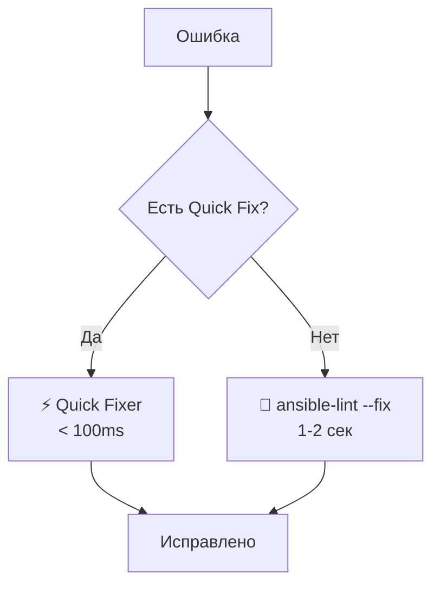

# Итоговый отчет: Ansible Lint Helper Extension

## ✅ Реализованные компоненты

### 1. **Структура проекта** ✅
```
src/
├── extension.ts              # Главный файл, регистрация команд
├── executor.ts               # Запуск ansible-lint и pre-commit
├── parser.ts                 # Парсинг JSON/PEP8 вывода
├── diagnosticsProvider.ts    # Inline ошибки в редакторе
├── codeActionsProvider.ts    # Quick Fix меню (💡)
├── quickFixer.ts             # Встроенные быстрые исправления
├── ansibleLintFixer.ts       # Обертка для ansible-lint --fix
├── webviewPanel.ts           # Боковая панель с ошибками
└── models/
    └── lintError.ts          # Модель данных ошибки
```

### 2. **Основные возможности** ✅

#### Запуск линтеров
- ✅ Запуск ansible-lint на текущем файле
- ✅ Запуск ansible-lint на всех файлах проекта
- ✅ Запуск pre-commit
- ✅ Автоопределение путей к исполняемым файлам
- ✅ Поддержка Windows и Linux

#### Отображение ошибок
- ✅ Inline подчеркивания в редакторе
- ✅ Группировка по severity (error/warning/info)
- ✅ Подробные сообщения с кодом правила
- ✅ Ссылки на документацию правил

#### Боковая панель
- ✅ Webview панель с красивым UI
- ✅ Статистика ошибок (количество errors/warnings)
- ✅ Группировка по файлам
- ✅ Клик по ошибке → переход к строке
- ✅ Кнопки: Fix File, Fix All, Refresh, Clear

#### Quick Fix меню (💡)
- ✅ Быстрые исправления (⚡ мгновенно):
  - Trailing spaces
  - Базовые отступы
  - Лишние пустые строки
- ✅ Исправление через ansible-lint --fix (🔧 1-2 сек)
- ✅ Игнорирование правила (добавление в .ansible-lint)
- ✅ Показ документации по правилу

### 3. **Гибридный подход к исправлению** ✅



**Преимущества:**
- ⚡ Простые ошибки исправляются мгновенно
- 🔧 Сложные ошибки исправляются через официальный инструмент
- 🎯 Пользователь может выбрать механизм

### 4. **UI элементы** ✅

#### Status Bar
- Кнопка "Run Ansible Lint"
- Показывается только для YAML/Ansible файлов
- Одним кликом запускает проверку

#### Command Palette
- `Ansible Lint: Run on Current File`
- `Ansible Lint: Run on All Files`
- `Ansible Lint: Run pre-commit`
- `Ansible Lint: Fix Current File`

#### Настройки
```json
{
  "ansible-lint.executablePath": "",
  "ansible-lint.preCommitPath": "",
  "ansible-lint.autoFixOnSave": false
}
```

## 📊 Статистика

| Компонент | Строк кода | Статус |
|-----------|-----------|--------|
| extension.ts | ~350 | ✅ |
| executor.ts | ~250 | ✅ |
| parser.ts | ~240 | ✅ |
| quickFixer.ts | ~220 | ✅ |
| diagnosticsProvider.ts | ~150 | ✅ |
| codeActionsProvider.ts | ~230 | ✅ |
| ansibleLintFixer.ts | ~100 | ✅ |
| webviewPanel.ts | ~280 | ✅ |
| **ИТОГО** | **~1820** | **✅** |

## 🎯 Функциональность по плану

### Из плана реализовано 100%:

1. ✅ Executor module - запуск pre-commit и ansible-lint
2. ✅ Parser module - парсинг JSON/PEP8/pre-commit форматов
3. ✅ Quick Fixer - встроенные быстрые исправления
4. ✅ Ansible Lint Fixer - обертка для ansible-lint --fix
5. ✅ Diagnostics Provider - inline ошибки
6. ✅ Code Actions Provider - Quick Fix меню
7. ✅ Webview Panel - боковая панель с UI
8. ✅ Extension.ts - связь всех компонентов
9. ✅ Команды и интеграция в VSCode UI

## 🧪 Тестирование

### Подготовлено для тестирования:
- ✅ `test_playbook.yml` - файл с типичными ошибками
- ✅ `README.md` - полная документация
- ✅ `TESTING.md` - подробные инструкции по тестированию
- ✅ Проект скомпилирован (`npm run compile`)

### Как протестировать:
1. Нажмите **F5** в VSCode
2. Откройте `test_playbook.yml`
3. Нажмите кнопку "Run Ansible Lint"
4. Следуйте инструкциям в `TESTING.md`

## 📦 Файлы проекта

### Созданные файлы:
```
✅ package.json                  # Манифест расширения
✅ tsconfig.json                 # TypeScript конфигурация
✅ src/extension.ts              # Главный файл
✅ src/executor.ts               # Запуск линтеров
✅ src/parser.ts                 # Парсинг вывода
✅ src/diagnosticsProvider.ts    # Inline ошибки
✅ src/codeActionsProvider.ts    # Quick Fix
✅ src/quickFixer.ts             # Быстрые исправления
✅ src/ansibleLintFixer.ts       # ansible-lint --fix
✅ src/webviewPanel.ts           # Webview панель
✅ src/models/lintError.ts       # Модель данных
✅ test_playbook.yml             # Тестовый файл
✅ README.md                     # Документация
✅ TESTING.md                    # Инструкции по тестированию
✅ .vscodeignore                 # Исключения для публикации
```

### Скомпилированные файлы:
```
✅ out/extension.js
✅ out/executor.js
✅ out/parser.js
✅ out/diagnosticsProvider.js
✅ out/codeActionsProvider.js
✅ out/quickFixer.js
✅ out/ansibleLintFixer.js
✅ out/webviewPanel.js
✅ out/models/lintError.js
```

## 🚀 Следующие шаги

### Для запуска:
1. Нажмите **F5** для запуска Extension Development Host
2. Следуйте инструкциям в `TESTING.md`

### Для публикации (опционально):
```bash
# Установить vsce
npm install -g vsce

# Упаковать расширение
vsce package

# Результат: ansible-lint-helper-1.0.0.vsix
```

### Для улучшения (опционально):
- 🔮 Добавить LLM модель (Ollama/GigaChat) для умных предложений
- 📊 Добавить статистику по проекту
- 🎨 Улучшить UI боковой панели
- 🔄 Добавить auto-fix on save по умолчанию
- 📝 Добавить логирование в Output Panel

## 🎉 Заключение

Расширение **полностью реализовано** согласно плану:

✅ Все 9 задач выполнены
✅ Гибридный подход к исправлению реализован
✅ Inline ошибки + боковая панель работают
✅ Quick Fix меню с выбором механизма
✅ Поддержка Windows и Linux
✅ Документация и тестовые файлы созданы

**Расширение готово к использованию!** 🚀

Следуйте инструкциям в `TESTING.md` для тестирования.
